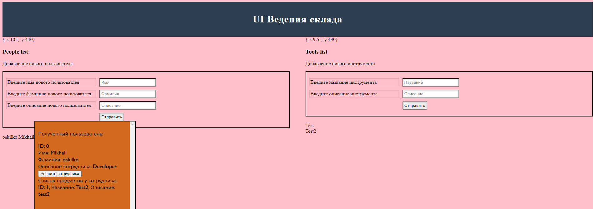

# Лабораторная работа №4

## Цель работы:

Получить навыки работы со специфичными для выбранной технологии/языка программирования приёмами.

## Вариант:

Разработка пользовательского интерфейса (UI) склада инструментов на языке программирования ```Clojure``` 

## Используемые технологии:

***Для разработки backend использовались:***

* ring - библиотека для написания веб-приложений
* compojure - дополнение для ring, упрощающее настройку машрутизации запросов
* codax - текстовая база данных

***Для разработки frontend использовались:***

* ClojureScript - реализация языка Clojure с компиляцией в JavaScript
* reagent - библиотека для ClojureScript, реализующая минимальный интерфейс для написания в стиле React

### Пример UI



## Серверная часть:
Расположение [тут](./tools/)

## Клиентская часть:
Расположение [тут](./front/hello-world/)

### Общие требования:

* программа должна быть реализована в функциональном стиле;
* требуется использовать идиоматичный для технологии стиль программирования;
* задание и коллектив должны быть согласованы;
* допустима совместная работа над одним заданием.

### Содержание отчёта:

* титульный лист;
* требования к разработанному ПО, включая описание алгоритма;
* реализация с минимальными комментариями;
* ввод/вывод программы;
* выводы (отзыв об использованных приёмах программирования).
